# Dependency Inversion Principle (DIP)

> High-level modules should not depend on low-level modules. Both should depend on abstractions.
> Abstractions should not depend on details. Details should depend on abstractions.

## Introduction

The Dependency Inversion Principle (DIP), introduced by Robert C. Martin as part of the SOLID principles, fundamentally changes how we think about dependency relationships in software design. Instead of having high-level modules directly depend on low-level modules, both should depend on abstractions, leading to more flexible and maintainable systems.

### Visual Representation of DIP

```mermaid
graph TD
    subgraph "Without DIP"
    A[High-Level Module] --> B[Low-Level Module]
    style A fill:#3f023f,stroke:#333
    style B fill:#290249,stroke:#333
    end

    subgraph "With DIP"
    C[High-Level Module] --> D[Abstract Interface]
    E[Low-Level Module] --> D
    style C fill:#3f023f,stroke:#333
    style D fill:#fff,stroke:#333
    style E fill:#290249,stroke:#333
    end
```



## Key Benefits

1. **Reduced Coupling**
   - Systems become more modular
   - Changes in low-level modules don't affect high-level modules
   - Easier maintenance and evolution

2. **Enhanced Testability**
   - Easy implementation of mock objects
   - Better unit testing capabilities
   - Simplified integration testing

3. **Improved Reusability**
   - Modules can be replaced without affecting the system
   - New implementations can be added easily
   - Greater code sharing possibilities

## Implementation Guide


## Practical Example

### Before DIP (Violation)

```java
class PaymentProcessor {
    private StripePaymentGateway paymentGateway;

    public PaymentProcessor() {
        this.paymentGateway = new StripePaymentGateway();  // Direct dependency
    }

    public void processPayment(double amount) {
        paymentGateway.charge(amount);
    }
}

class StripePaymentGateway {
    public void charge(double amount) {
        // Implementation for Stripe payment processing
    }
}
```

### After DIP (Compliant)

```java
interface IPaymentGateway {
    void processPayment(double amount);
}

class PaymentProcessor {
    private final IPaymentGateway paymentGateway;

    public PaymentProcessor(IPaymentGateway paymentGateway) {  // Dependency injection
        this.paymentGateway = paymentGateway;
    }

    public void processPayment(double amount) {
        paymentGateway.processPayment(amount);
    }
}

class StripePaymentGateway implements IPaymentGateway {
    public void processPayment(double amount) {
        // Stripe-specific implementation
    }
}

class PayPalPaymentGateway implements IPaymentGateway {
    public void processPayment(double amount) {
        // PayPal-specific implementation
    }
}
```

### Real-World Payment System Example

```mermaid
graph TB
    subgraph "Payment System Architecture"
    A[PaymentProcessor] --> B[IPaymentGateway]
    C[StripeGateway] --> B
    D[PayPalGateway] --> B
    E[BitcoinGateway] --> B
    style A fill:#5b0101,stroke:#333
    style B fill:#fff,stroke:#333
    style C fill:#00124e,stroke:#333
    style D fill:#00124e,stroke:#333
    style E fill:#00124e,stroke:#333
    end
```



## Common Anti-Patterns to Avoid

1. **Direct Instantiation**
   - Creating concrete instances inside classes
   - Using static factory methods that return concrete types

2. **Concrete Class Inheritance**
   - Inheriting from concrete classes instead of interfaces
   - Deep inheritance hierarchies

3. **Hidden Dependencies**
   - Dependencies created inside methods
   - Static method calls to concrete classes

## Best Practices

1. **Dependency Injection**
   - Constructor injection for required dependencies
   - Property injection for optional dependencies
   - Use DI containers when appropriate

2. **Interface Design**
   - Keep interfaces focused and cohesive
   - Follow Interface Segregation Principle
   - Design for abstraction, not implementation

3. **Testing Considerations**
   - Use mock objects for testing
   - Create test-specific implementations
   - Leverage dependency injection for unit tests

## Relationship with Other SOLID Principles

- **Single Responsibility Principle (SRP)**
  - DIP helps maintain SRP by separating interface from implementation
  - Makes responsibilities clearer through abstractions

- **Open/Closed Principle (OCP)**
  - DIP enables OCP by allowing new implementations without modification
  - Abstractions provide extension points

- **Interface Segregation Principle (ISP)**
  - DIP works with ISP to create focused interfaces
  - Both principles promote loose coupling

## When to Apply DIP

### Good Candidates for DIP:
- External service integrations
- Database access layers
- File system operations
- Network communications
- Complex business rules

### When to Reconsider:
- Simple CRUD operations
- Utility classes
- Data structures
- Performance-critical code sections

## Trade-offs and Considerations

### Advantages
- Flexibility in changing implementations
- Better testability
- Reduced coupling
- Enhanced maintainability

### Challenges
- Initial complexity increase
- More interfaces to manage
- Potential over-abstraction
- Learning curve for team members

## Conclusion

The Dependency Inversion Principle is a powerful tool for creating flexible, maintainable, and testable software systems. When applied appropriately, it can significantly improve code quality and reduce long-term maintenance costs. However, like all principles, it should be applied pragmatically, considering the specific needs and constraints of your project.
