# Interface Segregation Principle (ISP)

> No client should be forced to depend on methods it does not use.

## Introduction

The Interface Segregation Principle (ISP), introduced by Robert C. Martin, states that clients should not be forced to implement interfaces they don't use. Instead of having large, monolithic interfaces, we should break them down into smaller, more focused ones that are specific to client needs.

### Visual Representation of ISP

```mermaid
graph TD
    subgraph "Without ISP"
    A[Client A] --> B[Large Interface]
    C[Client B] --> B
    D[Client C] --> B
    style A fill:#3f023f,stroke:#333
    style B fill:#290249,stroke:#333
    style C fill:#3f023f,stroke:#333
    style D fill:#3f023f,stroke:#333
    end

    subgraph "With ISP"
    E[Client A] --> F[Interface A]
    G[Client B] --> H[Interface B]
    I[Client C] --> J[Interface C]
    style E fill:#3f023f,stroke:#333
    style F fill:#290249,stroke:#333
    style G fill:#3f023f,stroke:#333
    style H fill:#290249,stroke:#333
    style I fill:#3f023f,stroke:#333
    style J fill:#290249,stroke:#333
    end
```



## Key Benefits

1. **Reduced Dependencies**
   - Clients only depend on methods they need
   - Less coupling between components
   - Easier to maintain and modify

2. **Improved Maintainability**
   - Changes to one interface don't affect unrelated clients
   - Focused interfaces are easier to understand
   - Reduced risk when making changes

3. **Better Testability**
   - Smaller interfaces are easier to mock
   - More focused test cases
   - Clearer test boundaries

## Implementation Guide


## Practical Example

### Before ISP (Violation)

```java
interface Worker {
    void work();
    void eat();
    void sleep();
}

class Human implements Worker {
    public void work() {
        // Human working
    }
    
    public void eat() {
        // Human eating
    }
    
    public void sleep() {
        // Human sleeping
    }
}

class Robot implements Worker {
    public void work() {
        // Robot working
    }
    
    public void eat() {
        // Robot can't eat! Empty implementation
    }
    
    public void sleep() {
        // Robot doesn't sleep! Empty implementation
    }
}
```

### After ISP (Compliant)

```java
interface Workable {
    void work();
}

interface Eatable {
    void eat();
}

interface Sleepable {
    void sleep();
}

class Human implements Workable, Eatable, Sleepable {
    public void work() {
        // Human working
    }
    
    public void eat() {
        // Human eating
    }
    
    public void sleep() {
        // Human sleeping
    }
}

class Robot implements Workable {
    public void work() {
        // Robot working
    }
}
```

## Common Anti-Patterns to Avoid

1. **Fat Interfaces**
   - Large interfaces with many methods
   - Interfaces that serve multiple purposes
   - General-purpose interfaces

2. **Interface Pollution**
   - Forcing implementations of unnecessary methods
   - Empty or stub implementations
   - Default method abuse

3. **God Interfaces**
   - Interfaces trying to do everything
   - Lack of proper separation of concerns
   - One-size-fits-all approach

## Best Practices

1. **Interface Design**
   - Keep interfaces small and focused
   - Design from the client's perspective
   - Group related methods together

2. **Role-Based Interfaces**
   - Create interfaces based on roles
   - Consider client use cases
   - Think in terms of behaviors

3. **Refactoring Strategies**
   - Extract interfaces based on usage patterns
   - Use composition over inheritance
   - Consider default methods carefully

## Relationship with Other SOLID Principles

- **Single Responsibility Principle (SRP)**
  - ISP helps maintain SRP at the interface level
  - Both principles promote focused, cohesive designs

- **Dependency Inversion Principle (DIP)**
  - ISP creates better abstractions for DIP
  - Both principles reduce coupling

- **Open/Closed Principle (OCP)**
  - Segregated interfaces provide better extension points
  - Easier to extend without modification

## When to Apply ISP

### Good Candidates for ISP:
- Large service interfaces
- APIs with diverse clients
- Plugin systems
- Framework integration points
- Microservice contracts

### When to Reconsider:
- Simple data structures
- Internal implementation details
- Cohesive behavior groups
- Performance-critical code

## Trade-offs and Considerations

### Advantages
- More flexible design
- Easier maintenance
- Better testability
- Clearer client contracts

### Challenges
- More interfaces to manage
- Potential complexity in implementation
- Need for careful interface design
- Learning curve for team members

## Conclusion

The Interface Segregation Principle is a powerful tool for creating maintainable and flexible software systems. By designing focused interfaces that serve specific client needs, we can reduce coupling, improve maintainability, and create more robust applications. Remember to apply ISP pragmatically, considering the specific context and requirements of your project.
