# Liskov Substitution Principle (LSP)

> Subtypes must be substitutable for their base types without altering program correctness.

## Introduction

The Liskov Substitution Principle (LSP), introduced by Barbara Liskov in 1987, is a fundamental principle in object-oriented design that extends the Open/Closed principle. It states that objects of a superclass should be replaceable with objects of its subclasses without affecting the correctness of the program. In other words, derived classes must be completely substitutable for their base classes.

### Visual Representation of LSP

```mermaid
graph TD
    subgraph "LSP Violation"
    A[Client] --> B[Bird]
    B --> C[Penguin]
    D[fly()]
    style A fill:#3f023f,stroke:#333
    style B fill:#290249,stroke:#333
    style C fill:#5b0101,stroke:#333
    style D fill:#394101,stroke:#333
    end

    subgraph "LSP Compliant"
    E[Client] --> F[FlyingBird]
    E --> G[NonFlyingBird]
    H[Sparrow] --> F
    I[Penguin] --> G
    style E fill:#3f023f,stroke:#333
    style F fill:#290249,stroke:#333
    style G fill:#290249,stroke:#333
    style H fill:#014201,stroke:#333
    style I fill:#014201,stroke:#333
    end
```

## Key Benefits

1. **Type Safety**
   - Predictable behavior across inheritance hierarchies
   - Runtime errors prevention
   - Stronger contracts between classes

2. **Code Reusability**
   - Safe inheritance hierarchies
   - Plug-and-play component substitution
   - Improved code sharing

3. **Maintainability**
   - Reduced coupling between classes
   - Easier system evolution
   - Better error handling

## Implementation Guide


## Practical Example

### Before LSP (Violation)

```java
class Rectangle {
    protected int width;
    protected int height;
    
    public void setWidth(int width) {
        this.width = width;
    }
    
    public void setHeight(int height) {
        this.height = height;
    }
    
    public int getArea() {
        return width * height;
    }
}

class Square extends Rectangle {
    @Override
    public void setWidth(int width) {
        this.width = width;
        this.height = width;  // Violates LSP
    }
    
    @Override
    public void setHeight(int height) {
        this.width = height;  // Violates LSP
        this.height = height;
    }
}

// This code will break
void clientCode(Rectangle rectangle) {
    rectangle.setWidth(5);
    rectangle.setHeight(4);
    assert rectangle.getArea() == 20;  // Fails for Square
}
```

### After LSP (Compliant)

```java
interface Shape {
    int getArea();
}

class Rectangle implements Shape {
    private int width;
    private int height;
    
    public Rectangle(int width, int height) {
        this.width = width;
        this.height = height;
    }
    
    public int getArea() {
        return width * height;
    }
}

class Square implements Shape {
    private int side;
    
    public Square(int side) {
        this.side = side;
    }
    
    public int getArea() {
        return side * side;
    }
}

// This code works for all shapes
void clientCode(Shape shape) {
    int area = shape.getArea();
    // Use the area...
}
```

## Common LSP Violations to Avoid

1. **Contract Violations**
   - Strengthening preconditions in subclasses
   - Weakening postconditions in subclasses
   - Breaking invariants

2. **Behavioral Inconsistencies**
   - Throwing unexpected exceptions
   - Invalid return values
   - Side effects not present in base class

3. **Type Substitution Issues**
   - Partial implementation of interfaces
   - Incompatible parameter types
   - Incompatible return types

## Best Practices

1. **Design by Contract**
   - Define clear preconditions
   - Specify postconditions
   - Maintain invariants

2. **Inheritance Guidelines**
   - Use composition over inheritance when appropriate
   - Keep inheritance hierarchies shallow
   - Design for extension

3. **Testing Strategies**
   - Write tests at the base class level
   - Verify substitutability
   - Test with different derived types

## Real-World Example: File System Operations

```mermaid
graph TD
    subgraph "File System Hierarchy"
    A[Storage] --> B[ReadOnlyStorage]
    A --> C[ReadWriteStorage]
    D[MemoryStorage] --> C
    E[FileStorage] --> C
    F[NetworkStorage] --> C
    style A fill:#3f023f,stroke:#333
    style B fill:#290249,stroke:#333
    style C fill:#290249,stroke:#333
    style D fill:#014201,stroke:#333
    style E fill:#014201,stroke:#333
    style F fill:#014201,stroke:#333
    end
```



## Relationship with Other SOLID Principles

- **Single Responsibility Principle (SRP)**
  - LSP helps maintain SRP by encouraging proper abstraction
  - Both principles promote cohesive designs

- **Open/Closed Principle (OCP)**
  - LSP enables OCP by allowing safe extension
  - Both principles work together for flexible designs

- **Interface Segregation Principle (ISP)**
  - LSP works with ISP to create proper interfaces
  - Both principles ensure proper abstraction

## When to Apply LSP

### Good Candidates for LSP:
- Class hierarchies
- Framework designs
- Plugin architectures
- API design
- Collection implementations

### When to Reconsider:
- Unrelated types forced into inheritance
- State-dependent behaviors
- Implementation-specific features
- Performance-critical code

## Trade-offs and Considerations

### Advantages
- Type-safe designs
- Predictable behavior
- Easier maintenance
- Better reusability

### Challenges
- More complex design upfront
- Need for careful interface design
- Potential performance overhead
- Learning curve for developers

## Conclusion

The Liskov Substitution Principle is crucial for creating robust and maintainable object-oriented systems. By ensuring that derived classes can be safely substituted for their base classes, LSP helps create more reliable and flexible software. However, it requires careful thought and design to implement correctly. Always consider the behavioral implications of inheritance and ensure that your hierarchies maintain the substitutability principle.
