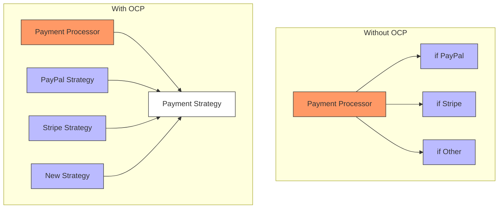
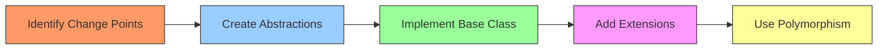
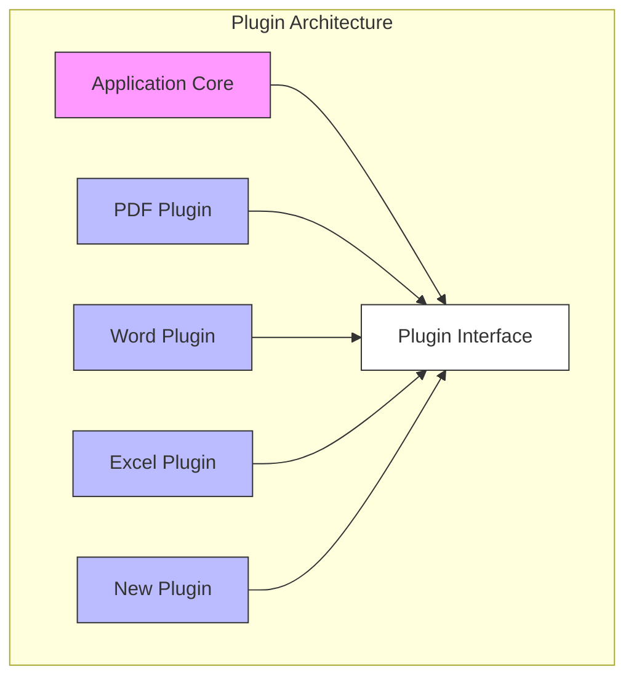

# Open-Closed Principle (OCP)

> Software entities should be open for extension, but closed for modification.

## Introduction

The Open-Closed Principle (OCP), introduced by Bertrand Meyer, is a fundamental principle in object-oriented design that suggests software entities (classes, modules, functions) should be open for extension but closed for modification. This means you should be able to add new functionality without changing existing code, promoting code stability and reducing the risk of bugs.

### Visual Representation of OCP



## Key Benefits

1. **Maintainability**
   - Reduced risk when adding features
   - Easier to understand code structure
   - Less regression testing needed

2. **Flexibility**
   - Easy to add new functionality
   - No modification of existing code
   - Plug-and-play components

3. **Reusability**
   - More modular design
   - Better code organization
   - Enhanced component isolation

## Implementation Guide



## Practical Example

### Before OCP (Violation)

```java
class Calculator {
    public double calculate(String operation, double a, double b) {
        if (operation.equals("add")) {
            return a + b;
        } else if (operation.equals("subtract")) {
            return a - b;
        } else if (operation.equals("multiply")) {
            return a * b;
        }
        throw new IllegalArgumentException("Unknown operation");
    }
}

// Adding new operations requires modifying existing code
```

### After OCP (Compliant)

```java
interface Operation {
    double execute(double a, double b);
}

class Addition implements Operation {
    public double execute(double a, double b) {
        return a + b;
    }
}

class Subtraction implements Operation {
    public double execute(double a, double b) {
        return a - b;
    }
}

class Multiplication implements Operation {
    public double execute(double a, double b) {
        return a * b;
    }
}

class Calculator {
    private final Map<String, Operation> operations = new HashMap<>();
    
    public void registerOperation(String name, Operation operation) {
        operations.put(name, operation);
    }
    
    public double calculate(String operation, double a, double b) {
        Operation op = operations.get(operation);
        if (op == null) {
            throw new IllegalArgumentException("Unknown operation");
        }
        return op.execute(a, b);
    }
}

// New operations can be added without modifying existing code
class Division implements Operation {
    public double execute(double a, double b) {
        if (b == 0) throw new ArithmeticException("Division by zero");
        return a / b;
    }
}
```

## Real-World Example: Plugin System



## Common Anti-Patterns to Avoid

1. **Switch Statement Smell**
   - Long if-else chains
   - Type checking in conditionals
   - Hard-coded behavior selection

2. **Rigid Design**
   - Concrete class inheritance
   - Tight coupling between components
   - Direct implementation dependencies

3. **Violation Indicators**
   - Frequent changes to existing classes
   - Cascading modifications
   - Difficult testing scenarios

## Best Practices

1. **Design Strategies**
   - Use interfaces and abstract classes
   - Implement strategy pattern
   - Apply template method pattern

2. **Extension Points**
   - Plan for future changes
   - Create clear extension interfaces
   - Use dependency injection

3. **Testing Considerations**
   - Test base implementations
   - Verify extension points
   - Ensure backward compatibility

## Relationship with Other SOLID Principles

- **Single Responsibility Principle (SRP)**
  - OCP complements SRP by promoting focused extensions
  - Both principles encourage modular design

- **Liskov Substitution Principle (LSP)**
  - OCP relies on LSP for safe extensions
  - Both principles work together for polymorphic behavior

- **Dependency Inversion Principle (DIP)**
  - OCP uses DIP for loose coupling
  - Both principles promote abstraction

## When to Apply OCP

### Good Candidates for OCP:
- Feature-rich applications
- Plugin architectures
- Framework design
- API development
- Business rule engines

### When to Reconsider:
- Simple, stable functionality
- Performance-critical code
- Throwaway code
- Rapid prototypes

## Trade-offs and Considerations

### Advantages
- Easy extension of functionality
- Reduced regression risks
- Better code organization
- Improved maintainability

### Challenges
- Initial design complexity
- More abstraction layers
- Learning curve
- Potential over-engineering

## Conclusion

The Open-Closed Principle is a powerful tool for creating maintainable and extensible software systems. When applied correctly, it allows systems to grow and adapt to new requirements without compromising existing functionality. However, like all principles, it should be applied pragmatically, considering the specific context and requirements of your project.
