# Single Responsibility Principle (SRP)

> A class should have only one reason to change.

## Introduction

The Single Responsibility Principle (SRP), introduced by Robert C. Martin, states that a class or module should have one, and only one, reason to change. This means that a class should have only one job or responsibility. SRP is fundamental to creating maintainable and flexible software designs.

### Visual Representation of SRP

```mermaid
graph TD
    subgraph "Without SRP"
    A[Employee Class] --> B[Calculate Pay]
    A --> C[Generate Report]
    A --> D[Save to Database]
    A --> E[Send Email]
    style A fill:#5b0101,stroke:#333
    style B fill:#290249,stroke:#333
    style C fill:#290249,stroke:#333
    style D fill:#290249,stroke:#333
    style E fill:#290249,stroke:#333
    end

    subgraph "With SRP"
    F[Employee] --> G[PayrollCalculator]
    F --> H[ReportGenerator]
    F --> I[EmployeeRepository]
    F --> J[EmailService]
    style F fill:#5b0101,stroke:#333
    style G fill:#290249,stroke:#333
    style H fill:#290249,stroke:#333
    style I fill:#290249,stroke:#333
    style J fill:#290249,stroke:#333
    end
```



## Key Benefits

1. **Maintainability**
   - Easier to understand and modify
   - Reduced risk of bugs
   - Better code organization

2. **Testability**
   - Focused unit tests
   - Simpler test cases
   - Better test coverage

3. **Reusability**
   - More cohesive components
   - Clear boundaries
   - Better separation of concerns

## Implementation Guide


## Practical Example

### Before SRP (Violation)

```java
class UserService {
    private Database db;
    private EmailSender emailSender;
    
    public void createUser(String name, String email) {
        // Database logic
        User user = new User(name, email);
        db.save(user);
        
        // Email logic
        String welcomeMessage = "Welcome " + name + "!";
        emailSender.send(email, welcomeMessage);
        
        // Logging logic
        System.out.println("User created: " + name);
        logToFile("User " + name + " created at " + new Date());
    }
    
    private void logToFile(String message) {
        // File I/O operations
        try (FileWriter fw = new FileWriter("app.log", true)) {
            fw.write(message + "\n");
        } catch (IOException e) {
            e.printStackTrace();
        }
    }
}
```

### After SRP (Compliant)

```java
class UserService {
    private final UserRepository userRepository;
    private final NotificationService notificationService;
    private final LoggingService loggingService;
    
    public UserService(
            UserRepository userRepository,
            NotificationService notificationService,
            LoggingService loggingService) {
        this.userRepository = userRepository;
        this.notificationService = notificationService;
        this.loggingService = loggingService;
    }
    
    public void createUser(String name, String email) {
        User user = new User(name, email);
        userRepository.save(user);
        notificationService.sendWelcomeMessage(user);
        loggingService.logUserCreation(user);
    }
}

class UserRepository {
    private final Database db;
    
    public void save(User user) {
        db.save(user);
    }
}

class NotificationService {
    private final EmailSender emailSender;
    
    public void sendWelcomeMessage(User user) {
        String welcomeMessage = "Welcome " + user.getName() + "!";
        emailSender.send(user.getEmail(), welcomeMessage);
    }
}

class LoggingService {
    public void logUserCreation(User user) {
        String message = "User " + user.getName() + " created at " + new Date();
        System.out.println(message);
        writeToFile(message);
    }
    
    private void writeToFile(String message) {
        // File I/O operations
    }
}
```

## Common Anti-Patterns to Avoid

1. **God Class**
   - Classes that do everything
   - Multiple unrelated methods
   - Too many instance variables

2. **Mixed Concerns**
   - Business logic with UI code
   - Data access with validation
   - Processing with reporting

3. **Shotgun Surgery**
   - Changes affecting multiple classes
   - Scattered responsibilities
   - Tight coupling

## Best Practices

1. **Class Design**
   - Keep classes focused
   - Clear naming conventions
   - Single level of abstraction

2. **Responsibility Assignment**
   - Clear boundaries
   - Cohesive functionality
   - Proper encapsulation

3. **Code Organization**
   - Logical separation
   - Clear dependencies
   - Modular structure

## Real-World Example: Order Processing

```mermaid
graph TD
    subgraph "Order Processing System"
    A[OrderProcessor] --> B[OrderValidator]
    A --> C[InventoryManager]
    A --> D[PaymentProcessor]
    A --> E[ShippingService]
    A --> F[NotificationService]
    style A fill:#3f023f,stroke:#333
    style B fill:#290249,stroke:#333
    style C fill:#290249,stroke:#333
    style D fill:#290249,stroke:#333
    style E fill:#290249,stroke:#333
    style F fill:#290249,stroke:#333
    end
```



## Relationship with Other SOLID Principles

- **Open/Closed Principle (OCP)**
  - SRP makes it easier to extend functionality
  - Classes are more focused and stable

- **Interface Segregation Principle (ISP)**
  - SRP at the interface level
  - Clear client-specific interfaces

- **Dependency Inversion Principle (DIP)**
  - SRP helps identify proper abstractions
  - Cleaner dependency hierarchies

## When to Apply SRP

### Good Candidates for SRP:
- Business logic classes
- Service layers
- Data access components
- UI controllers
- Utility classes

### When to Reconsider:
- Simple data structures
- Value objects
- DTOs
- Configuration classes

## Trade-offs and Considerations

### Advantages
- Easier maintenance
- Better testing
- Clear responsibilities
- Reduced coupling

### Challenges
- More classes to manage
- Initial design overhead
- Finding right granularity
- Proper abstraction levels

## Conclusion

The Single Responsibility Principle is a cornerstone of good software design. When applied correctly, it leads to more maintainable, testable, and flexible code. While it may require more initial planning and result in more classes, the benefits of having focused, cohesive components far outweigh the costs. Remember to apply SRP pragmatically, considering your specific context and requirements.
